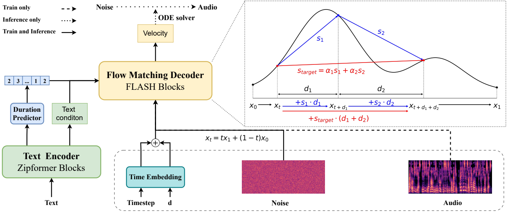

# SFM-TTS-unf

Unofficial implementation of _**["SFM-TTS: Lightweight and Rapid Speech Synthesis with Flexible Shortcut Flow Matching"](https://doi.org/10.1109/ICASSP55912.2026.11460811)**_ in pytorch.



Due to lack of details, the number of parameters is slightly larger than the one proposed in the paper.

## Pre-Requisites
1. Python >= 3.11
2. CUDA
3. [Pytorch](https://pytorch.org/get-started/previous-versions/#v251) version 2.5.1 (+cu118) or higher
4. Clone this repository
5. Install python requirements.
   ```
   pip install -r requirements.txt
   ```
   If you want to proceed with those cleaned texts in [filelists](filelists), you have to install espeak.
   ```
   apt-get install espeak
   ```
   If you want to use triton based super-monotonic align on Windows system, try installing triton-windows instead of triton

6. [Download Hifi-GAN checkpoint](https://drive.google.com/drive/folders/1-eEYTB5Av9jNql0WGBlRoi-WH2J7bp5Y)
   
   - The demo configurations of this repo use `UNIVERSAL_V1` and define its path as `"vocoder_path": "UNIVERSAL_V1/g_02500000"` from project root.
   

7. Prepare datasets & configuration
   
   i) Demo configuration (LJS/VCTK Dataset) 
    - LJS : Download and extract the LJ Speech dataset, then rename or create a link to the dataset folder: `ln -s /path/to/LJSpeech-1.1/wavs DUMMY1`
    - VCTK : Download and extract the VCTK Speech dataset, then rename or create a link to the dataset folder: `ln -s /path/to/LJSpeech-1.1/wavs DUMMY2`
   
   ii) Custom configuration
   1. wav files (22050Hz Mono, PCM-16) 
   2. Prepare text files. One for training<sup>[(ex)](filelists/ljs_audio_text_train_filelist.txt)</sup> and one for validation<sup>[(ex)](filelists/ljs_audio_text_val_filelist.txt)</sup>. Split your dataset to each files. As shown in these examples, the datasets in validation file should be fewer than the training one, while being unique from those of training text.
      
      - Single speaker<sup>[(ex)](filelists/ljs_audio_text_test_filelist.txt)</sup>
      
      ```
      wavfile_path|transcript
      ```
   
      - Multi speaker<sup>[(ex)](filelists/vctk_audio_sid_text_test_filelist.txt)</sup>
      
      ```
      wavfile_path|speaker_id|transcript
      ```

   3. Run preprocessing with a [cleaner](text/cleaners.py) of your interest. You may change the [symbols](text/symbols.py) as well.
      - Single speaker
      ```
      python preprocess.py --text_index 1 --filelists PATH_TO_train.txt --text_cleaners CLEANER_NAME
      python preprocess.py --text_index 1 --filelists PATH_TO_val.txt --text_cleaners CLEANER_NAME
      ```
      
      - Multi speaker
      ```
      python preprocess.py --text_index 2 --filelists PATH_TO_train.txt --text_cleaners CLEANER_NAME
      python preprocess.py --text_index 2 --filelists PATH_TO_val.txt --text_cleaners CLEANER_NAME
      ```
      
      The resulting cleaned text would be like [this(single)](filelists/ljs_audio_text_test_filelist.txt.cleaned). <sup>[ex - multi](filelists/vctk_audio_sid_text_test_filelist.txt.cleaned)</sup> 


8. **(OPTIONAL)** Build Monotonic Alignment Search.
   
   This repo supports [supertone-inc](https://github.com/supertone-inc)'s [super-monotonic-align](https://github.com/supertone-inc/super-monotonic-align) for MAS. It removes Cython dependency(v1, v2, triton) and thus you do not have to build it anymore.
   However, you can still use the original by the following 
   ```sh
   # Cython-version Monotonoic Alignment Search
   cd monotonic_align
   mkdir monotonic_align
   python setup.py build_ext --inplace
   ```
   and set ```"model": {"monotonic_align": "ma"}``` in your configuration file.

   
9. Edit [configurations](configs) based on files and cleaners you used.

### Monotonic Align configuration
 1. Super Monotonic Align (JIT_v1)
    ```
    "model": {"monotonic_align": "sma_v1"}
    ```
 2. Super Monotonic Align (JIT_v2)
    ```
    "model": {"monotonic_align": "sma_v2"}
    ```
 3. Super Monotonic Align (Triton)
    ```
    "model": {"monotonic_align": "sma_triton"}
    ```
 4. Monotonic Align (original Cython version)
    
    ```
    "model": {"monotonic_align": "ma"}
    ```

## Training example
```sh 
# LJS
python train.py -c configs/SFM-LJS.json -m models/test
```

```sh 
# VCTK
python train.py -c configs/SFM-VCTK.json -m models/test
```

## Credits
WIP
